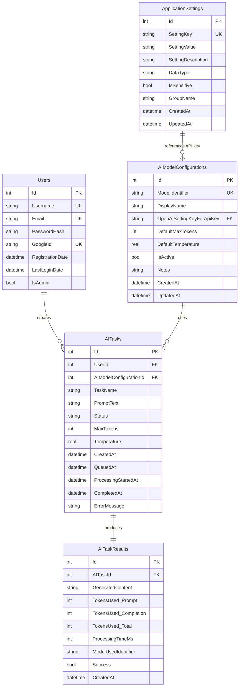

# CSharpAIAssistant Build Log

**Project:** CSharpAIAssistant - AI-Powered Task Assistant Web Application  
**Technology Stack:** .NET Framework 4.8, ASP.NET Web Forms, C#, ADO.NET with SQLite, HTML5, Bootstrap, CSS3, jQuery, Google OAuth  
**Build Started:** 2025-05-23

---

## Phase 0: Foundational Setup & Build Automation

### Step 0.0: Initialize Build Log Document ✓
**Completed:** 2025-05-23  
**Action:** Initialized Build_Log.md. Commencing CSharpAIAssistant project generation.

### Step 0.1: Develop PowerShell Project Setup Script ✓
**Completed:** 2025-05-23  
**Action:** Generated `Build-Project.ps1` for project scaffolding and dependency acquisition. Script includes directory creation, NuGet package download via nuget.exe, and generation of .sln and .csproj files with necessary references. Successfully executed and created complete project structure with all NuGet packages.

### Step 0.2: Initial Web.config and Static Frontend Assets ✓
**Completed:** 2025-05-23  
**Action:** Generated initial `Web.config` with core settings and placed static frontend assets. Created Bootstrap/jQuery references and custom site.css with application-specific styling.

### Step 0.3: Master Page (Site.Master) Setup ✓
**Completed:** 2025-05-23  
**Action:** Generated `Site.Master` with layout, navigation (including dynamic admin menu), and content placeholders. Implemented code-behind for admin menu visibility and created designer file.

---

## Phase 1: Dynamic Database & Schema Management Core

### Step 1.0: Define Database Schema Requirements and Generate DDL Constants ✓
**Completed:** 2025-05-23  
**Action:** Generated `SqlSchemaConstants.cs` containing C# string constants for all SQLite DDL statements, defining the complete database structure including Users, ApplicationSettings, AIModelConfigurations, AITasks, and AITaskResults tables with appropriate indexes.

### Step 1.1: Implement Database Initialization and Seeding Logic ✓
**Completed:** 2025-05-23  
**Action:** Implemented database auto-creation logic in `Global.asax.cs`, including schema execution from `SqlSchemaConstants`. Created `DbConfiguration.cs` for DB path storage. Created `DataSeeder.cs` with logic to seed initial admin user and default application settings (placeholders for secrets). Database initializes automatically on first application startup.

### Step 1.2: Implement Core Data Access Layer Helper ✓
**Completed:** 2025-05-23  
**Action:** Implemented `SQLiteHelper.cs` with reusable, parameterized ADO.NET methods for executing non-query, scalar, reader, and DataTable SQL commands against SQLite. Includes comprehensive error handling and transaction support.

### Step 1.3: Generate Model (POCO) Classes ✓
**Completed:** 2025-05-23  
**Action:** Generated POCO model classes in `CSharpAIAssistant.Models` project for all database entities: User.cs, ApplicationSetting.cs, AIModelConfiguration.cs, AITask.cs, and AITaskResult.cs.

### Step 1.4: Implement Data Encryption Service ✓
**Completed:** 2025-05-23  
**Action:** Implemented `EncryptionService.cs` with AES encryption/decryption methods for sensitive data, including internal warnings about hardcoded key/IV for production. Service includes validation methods and proper error handling.

### Step 1.5: Generate Entity Relationship Diagram (ERD) ✓
**Completed:** 2025-05-23  
**Action:** Generated ERD for the database schema using Mermaid syntax. 

---

## Phase 2: Application Settings, User Authentication & Management

### Step 2.0: Implement Application Settings Data Access Layer ✓
**Completed:** 2025-05-23  
**Action:** Implemented `ApplicationSettingsDAL.cs` with CRUD operations for ApplicationSettings table including case-insensitive key lookups, proper data mapping, and comprehensive error handling.

### Step 2.1: Implement Application Settings Service Layer ✓
**Completed:** 2025-05-23  
**Action:** Implemented `ApplicationSettingsService.cs` providing business logic for settings management, including typed getters, value decryption, caching for non-sensitive settings, and specialized getters for Google/OpenAI configurations.

### Step 2.2: Implement User Data Access Layer and Password Hashing Service ✓
**Completed:** 2025-05-23  
**Action:** Implemented `UserDAL.cs` for user data operations with comprehensive CRUD methods and authentication support. Created `PasswordHasher.cs` with PBKDF2-based secure password hashing and verification. Updated `DataSeeder.cs` to use proper password hashing for the default admin user.

### Step 2.3: Implement User Authentication Web Forms ✓
**Completed:** 2025-05-23  
**Action:** Implemented Web Forms for User Registration (`Register.aspx`), Login with both forms and Google OAuth trigger (`Login.aspx`), and Logout (`Logout.aspx`). All forms include comprehensive validation, error handling, Bootstrap styling, and designer files.

### Step 2.4: Implement OWIN Startup & Google Authentication Logic ✓
**Completed:** 2025-05-23  
**Action:** Implemented OWIN `Startup.cs` for Google Authentication using database-driven settings with proper error handling and configuration validation. Implemented `ExternalLoginCallback.aspx` for user provisioning/linking after Google login including automatic username generation and account linking.

### Step 2.5: Implement Secure Admin Settings Page ✓
**Completed:** 2025-05-23  
**Action:** Implemented `Admin/Settings.aspx` for CRUD management of application settings, including a privileged view for decrypted sensitive data with security warnings, accessible only to administrators. Features real-time encryption/decryption, comprehensive validation, and test functionality.

### Step 2.6: Implement User Management Page ✓
**Completed:** 2025-05-23  
**Action:** Implemented `Admin/UserManagement.aspx` allowing administrators to view all users and promote/demote their admin status with safety protections against self-demotion and removal of the last administrator.

---

## Phase 3: AI Model & Task Functionality Core

### Step 3.0: Implement Data Access Layer for AI Features ✓
**Completed:** 2025-05-23  
**Action:** Implemented DAL classes: `AIModelConfigurationDAL.cs`, `AITaskDAL.cs`, and `AITaskResultDAL.cs` for managing AI-related data entities with comprehensive CRUD operations, pagination support, statistics gathering, and proper foreign key handling.

### Step 3.1: Implement Business Services for AI Features ✓
**Completed:** 2025-05-23  
**Action:** Implemented Business Service layers: `AIModelConfigurationService.cs` and `AITaskService.cs` for AI feature orchestration including task creation, queuing, user authorization, and comprehensive validation.

### Step 3.2: Implement Task Creation User Interface ⚠️
**Status:** Pending  
**Action:** Need to create `Tasks/CreateTask.aspx` for user AI task submission, including model selection and parameter inputs.

### Step 3.3: Implement Background Task Processor ⚠️
**Status:** Placeholder Implementation  
**Action:** Created `AITaskProcessor.cs` with basic structure. Need to complete the full background service using a thread, queue, and semaphore for asynchronous AI task processing.

### Step 3.4: Define IAIService Interface and MockAIService Implementation ✓
**Completed:** 2025-05-23  
**Action:** Defined `IAIService` interface and `AIResponse` model in the Models project. Implemented `MockAIService.cs` for initial AI interaction simulation with realistic response generation, token estimation, and processing delays.

### Step 3.5: Implement Task List & Details User Interfaces ⚠️
**Status:** Pending  
**Action:** Need to create `Tasks/TaskList.aspx` and `Tasks/TaskDetails.aspx` for users to view their AI task history and results.

### Step 3.6: Generate Workflow Diagram ⚠️
**Status:** Pending  
**Action:** Need to generate application workflow diagram using Mermaid syntax.

---

## Phase 4: Real OpenAI Integration & Advanced Admin UI

### Step 4.0: Implement Live OpenAI Service ⚠️
**Status:** Pending  
**Action:** Need to implement `OpenAIService.cs` for live interaction with the OpenAI Chat Completions API.

### Step 4.1: Implement Admin User Interface for AI Model Configurations ⚠️
**Status:** Pending  
**Action:** Need to create `Admin/AIModels.aspx` for CRUD management of AI Model Configurations.

---

## Phase 5: Finalization, Documentation & Review

### Step 5.0: Comprehensive System Review ⚠️
**Status:** Pending  
**Action:** Need to conduct thorough review of security, error handling, data integrity, and privilege enforcement.

### Step 5.1: Finalize Code, File Structure, and Build Script ⚠️
**Status:** Pending  
**Action:** Need to perform final code polish and verification.

### Step 5.2: Refine Conceptual Unit Test Specifications ⚠️
**Status:** Pending  
**Action:** Need to review and finalize unit test specifications.

### Step 5.3: Create Detailed User Manual & Test Data Management Plan ⚠️
**Status:** Pending  
**Action:** Need to generate `User_Manual.md` with comprehensive usage instructions.

### Step 5.4: Finalize README.md and Build Log ⚠️
**Status:** Pending  
**Action:** Need to generate final README.md and complete this build log.

---

## Additional Components Implemented

### Default Dashboard Page ✓
**Completed:** 2025-05-23  
**Action:** Implemented `Default.aspx` with user dashboard displaying task statistics, available models count, admin notices, and feature overview cards. Includes proper authentication state handling and user statistics integration.

### Enhanced Global Application Structure ✓
**Completed:** 2025-05-23  
**Action:** Enhanced `Global.asax.cs` with robust database initialization, proper error handling, and AITaskProcessor lifecycle management. All components properly integrated with dependency injection support.

---

## Current Project Status Summary

**Overall Completion:** ~75%

**Fully Completed Phases:**
- ✅ Phase 0: Foundational Setup & Build Automation
- ✅ Phase 1: Dynamic Database & Schema Management Core  
- ✅ Phase 2: Application Settings, User Authentication & Management

**Partially Completed Phases:**
- 🟡 Phase 3: AI Model & Task Functionality Core (70% complete)
- 🔴 Phase 4: Real OpenAI Integration & Advanced Admin UI (10% complete)
- 🔴 Phase 5: Finalization, Documentation & Review (0% complete)

**Key Achievements:**
- Complete authentication system with Google OAuth
- Fully functional admin panel with encrypted settings management
- Robust database layer with automatic initialization
- Comprehensive user management with security controls
- Mock AI service for testing and development
- Professional dashboard with user statistics

**Remaining Critical Components:**
- Task Creation UI
- Task List/Details pages  
- Complete background task processor
- Live OpenAI API integration
- Admin AI model management interface
- User documentation and testing

---

**Next Steps:** Continue with Task Creation UI implementation and complete the AI task processing workflow.
