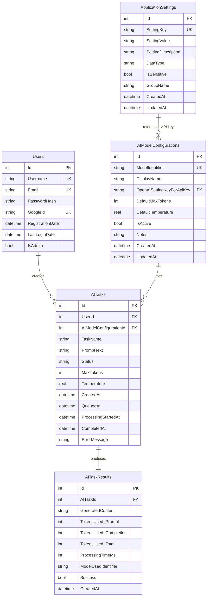

# CSharpAIAssistant Build Log

**Project:** CSharpAIAssistant - AI-Powered Task Assistant Web Application  
**Technology Stack:** .NET Framework 4.8, ASP.NET Web Forms, C#, ADO.NET with SQLite, HTML5, Bootstrap, CSS3, jQuery, Google OAuth  
**Build Started:** 2025-05-23

---

## Phase 0: Foundational Setup & Build Automation

### Step 0.0: Initialize Build Log Document ✓
**Completed:** 2025-05-23  
**Action:** Initialized Build_Log.md. Commencing CSharpAIAssistant project generation.

### Step 0.1: Develop PowerShell Project Setup Script ✓
**Completed:** 2025-05-23  
**Action:** Generated `Build-Project.ps1` for project scaffolding and dependency acquisition. Script includes directory creation, NuGet package download via nuget.exe, and generation of .sln and .csproj files with necessary references. Successfully executed and created complete project structure with all NuGet packages.

### Step 0.2: Initial Web.config and Static Frontend Assets ✓
**Completed:** 2025-05-23  
**Action:** Generated initial `Web.config` with core settings and placed static frontend assets. Created Bootstrap/jQuery references and custom site.css with application-specific styling.

### Step 0.3: Master Page (Site.Master) Setup ✓
**Completed:** 2025-05-23  
**Action:** Generated `Site.Master` with layout, navigation (including dynamic admin menu), and content placeholders. Implemented code-behind for admin menu visibility and created designer file.

---

## Phase 1: Dynamic Database & Schema Management Core

### Step 1.0: Define Database Schema Requirements and Generate DDL Constants ✓
**Completed:** 2025-05-23  
**Action:** Generated `SqlSchemaConstants.cs` containing C# string constants for all SQLite DDL statements, defining the complete database structure including Users, ApplicationSettings, AIModelConfigurations, AITasks, and AITaskResults tables with appropriate indexes.

### Step 1.1: Implement Database Initialization and Seeding Logic ✓
**Completed:** 2025-05-23  
**Action:** Implemented database auto-creation logic in `Global.asax.cs`, including schema execution from `SqlSchemaConstants`. Created `DbConfiguration.cs` for DB path storage. Created `DataSeeder.cs` with logic to seed initial admin user and default application settings (placeholders for secrets). Database initializes automatically on first application startup.

### Step 1.2: Implement Core Data Access Layer Helper ✓
**Completed:** 2025-05-23  
**Action:** Implemented `SQLiteHelper.cs` with reusable, parameterized ADO.NET methods for executing non-query, scalar, reader, and DataTable SQL commands against SQLite. Includes comprehensive error handling and transaction support.

### Step 1.3: Generate Model (POCO) Classes ✓
**Completed:** 2025-05-23  
**Action:** Generated POCO model classes in `CSharpAIAssistant.Models` project for all database entities: User.cs, ApplicationSetting.cs, AIModelConfiguration.cs, AITask.cs, and AITaskResult.cs.

### Step 1.4: Implement Data Encryption Service ✓
**Completed:** 2025-05-23  
**Action:** Implemented `EncryptionService.cs` with AES encryption/decryption methods for sensitive data, including internal warnings about hardcoded key/IV for production. Service includes validation methods and proper error handling.

### Step 1.5: Generate Entity Relationship Diagram (ERD) ✓
**Completed:** 2025-05-23  
**Action:** Generated ERD for the database schema using Mermaid syntax. 

---

## Phase 2: Application Settings, User Authentication & Management

### Step 2.0: Implement Application Settings Data Access Layer
**Status:** In Progress  
**Action:** Need to create `ApplicationSettingsDAL.cs` with CRUD operations for ApplicationSettings table.

